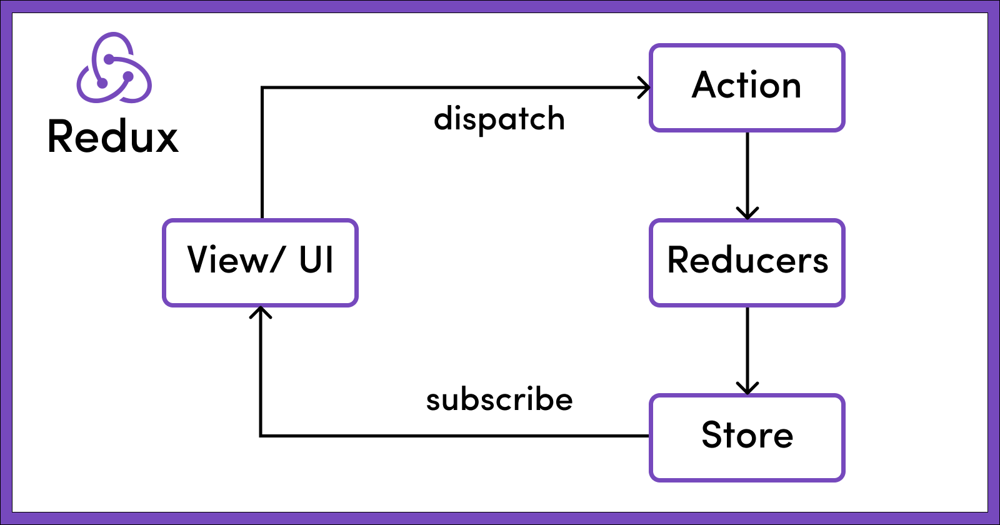
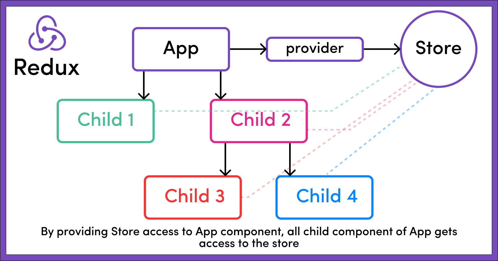
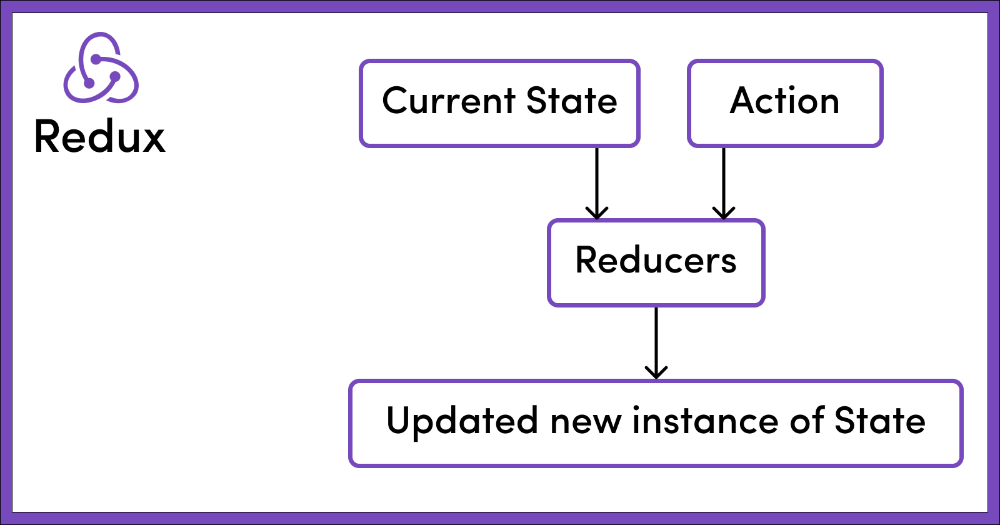

## Redux - It's a state management library, it will basically store and manage all the application's states. The global state of an application is stored in an object tree within a single store called as Redux store.

State is Read-Only in Redux. What makes Redux predictable is that to make a change in the state of the application, we need to dispatch an action which describes what changes we want to make in the state.
These actions are then consumed by something known as Recuders, whose sole job is to accept two things(the action and current state of the application) and return new updated instance of the state.
Recuders do not change any part of the state, rather it produces a new instance of the state with all the necessary updates.

 

### Actions - The only way to change the state is to emit an action, which is an object describing what happened.
Every Action must have at least a **type** associated with it and data required for the state change denoted by **payload**.

#### Example - 
    {
        type: "",
        payload: {}
    }

    
    const dispatch = useDispatch();
    const addItemToCart = () => {
        return {
            type: "ADD_ITEM_TO_CART",    // Note: Every action must have a type key.
            payload: {
                bookName: "Harry Potter adn teh Goblet fier.",
                noOfItem: 1
            }
        }
    }

#### Reducers - Reducers are pure JavaScript functions that determine how an application's state changes in response to an action. As the name suggests, take in two things: current state and an action. Then they reduce it (read it & return) to one entity: the new updated instance of the state.

* There can either be one reducer if it is a simple app or multiple recuders taking care of different parts or slices of the global state in a bigger application. So whenever an action is dispatched, all the reducers are activated.